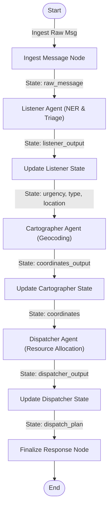

# Crisis-Router: Detailed Design Paper & Technical Reference Documentation

## Abstract
In large-scale natural disasters (e.g., floods, earthquakes, wildfires), traditional emergency voice communication channels (such as 911 dispatch lines) frequently suffer from severe bottlenecks. Due to high volumes of calls, voice networks face congestion, and response dispatch times increase. Conversely, digital text channels (SMS, mobile data, satellite text beacons, and social media posts) require low bandwidth and can transmit even when voice networks fail. 

**Crisis-Router** is a multi-agent emergency dispatch and triage system built using the **Vertex AI Agent Development Kit (ADK)**, **FastAPI**, and **Streamlit**. It automatically ingests unstructured text messages, triages their urgency, extracts location descriptions, geocodes locations on an interactive map, and dispatches rescue resources from a real-time registry. This paper details the architecture, design decisions, implementation details, and agentic principles demonstrated by Crisis-Router.

---

## 1. Project Background and Objective
During emergency situations, rapid processing of information is critical. Every second delayed in routing an emergency request can have severe consequences. However, humans reporting emergencies rarely provide structured data. Instead, they provide unstructured text descriptions (e.g., *"HELP! There is a fire blocking my front door on 5th Ave in SF!"*).

Traditional emergency response centers rely on human operators to manually read, interpret, geocode, and route these messages. In a major natural disaster, this manual workflow fails to scale. 

The primary objective of **Crisis-Router** is to automate the parsing, geocoding, and routing of emergency distress signals. By utilizing specialized LLM agents in a sequential workflow graph, the system can parse unstructured text, look up geographical coordinates via a web API, cross-reference locations with a stateful rescue registry, and output a structured dispatch plan.

---

## 2. Multi-Agent System Architecture
Crisis-Router is structured as a sequential graph workflow composed of three specialized agents and state update nodes. It relies on the **Blackboard Architectural Pattern** for state management, where all agents read from and write to a central validated Pydantic state schema (`CrisisState`).

### 2.1 State Management (`CrisisState`)
The core memory of the system is the `CrisisState` Pydantic class. Unlike generic chat applications that store unstructured conversation history list arrays, Crisis-Router uses a strictly typed schema:
*   `raw_message` (str): The raw distress signal input text.
*   `urgency` (Literal): The classified urgency level (Critical, High, Moderate, Informational).
*   `incident_type` (str): The categorized incident type (e.g., Fire, Flood, Medical, etc.).
*   `location_text` (str): The text-based location extracted from the signal.
*   `coordinates` (dict): The resolved latitude and longitude.
*   `dispatch_plan` (str): The deployment description of the allocated rescue unit.
*   `listener_output` / `coordinates_output` / `dispatcher_output`: Optional fields storing the structured outputs of the respective agents.

---

## 3. Workflow Ingestion and Agent Details

### 3.1 Listener Agent (Ingestion & Triage)
The **Listener Agent** acts as the ingestion gateway. Its role is to perform Named Entity Recognition (NER) on the unstructured raw message.
*   **Prompt Design**: It is given system instructions to classify the urgency and extract key entities. The urgency classification follows emergency service protocols (e.g., assessing threats to life vs. infrastructure damage).
*   **Structured Output**: To prevent the model from outputting free-form conversational text, it is bound to the `ListenerOutput` schema. The model must output a JSON object matching this schema exactly.
*   **State Update**: Once the agent completes its run, the workflow passes control to the `update_listener_state` node, which copies the extracted values (`urgency`, `incident_type`, `location_text`) into the main `CrisisState` variables.

### 3.2 Cartographer Agent (Geocoding)
The **Cartographer Agent** is responsible for geographic resolution. 
*   **Tool Binding**: It is equipped with the `geocode_location` tool. This tool is a Python function that executes a web request to the OpenStreetMap Nominatim Search API to look up coordinates for the `location_text`.
*   **Local Fallback Logic**: If the network connection is offline, the API key is missing, or the Nominatim lookup fails, the tool includes a local geocoding fallback dictionary (mapping cities like San Francisco, Miami, Seattle, and New York to coordinates) to ensure the system remains operational.
*   **Output**: The agent maps the resolved latitude and longitude to the `CartographerOutput` schema, and the workflow updates the main state `coordinates` dictionary via the `update_cartographer_state` node.

### 3.3 Dispatcher Agent (Resource Allocation)
The **Dispatcher Agent** is the decision-making engine that assigns simulated rescue units.
*   **The Stateful Unit Registry**: Instead of randomly assigning a unit number, this agent is bound to the `allocate_rescue_unit` tool. This tool reads a persistent database file (`app/disaster_system.json`) representing a fleet of rescue units:
    *   *Fire Engine 1* (Type: Fire)
    *   *Rescue Boat 2* (Type: Flood)
    *   *Ambulance 3* (Type: Medical)
    *   *Utility Crew 4* (Type: Infrastructure)
    *   *Rescue Helicopter 5* (Type: Trapped)
    *   *Hazmat Engine 6* (Type: Other)
*   **Tool Execution**: The tool reads the current status of all units. It attempts to allocate an `Available` unit that matches the emergency type. If the matching unit is busy, it allocates any other available unit. If all units are busy, it queues the dispatch request. The chosen unit is marked as `Busy` and its deployment destination is recorded.
*   **Output**: The agent maps the tool's result to the `DispatcherOutput` schema, and the `update_dispatcher_state` node saves it to the central `dispatch_plan` state variable.

---

## 4. Role-Separated Operational Dashboards
A key design consideration is that civilians in distress require a different interface than emergency dispatchers. Crisis-Router separates these roles into two distinct views:

### 4.1 Civilian Distress Console
*   **Focus**: Simple, clear, and reassuring.
*   **Submission**: Provides preset signals for testing and a free-text input box.
*   **Visual Elements**: When a signal is submitted, it shows a spinner, then displays a clear confirmation card: *"Emergency Signal Ingested. First Responder Status: [Dispatched Unit]. Please stay safe."*
*   **Exclusions**: Hides technical developer details, map coordinates, and system logs to prevent information overload during a crisis.

### 4.2 Dispatcher Ops Center
*   **Focus**: Situational awareness and fleet management.
*   **Live Operational Map**: Renders an interactive map showing all processed incidents. Urgency levels are color-coded (red markers for Critical/High, orange for Moderate). Clicking on a marker displays the incident type and dispatch plan.
*   **Rescue Unit Status Registry**: Displays a real-time table of all rescue units and their current status (Available vs Deployed locations).
*   **Distress Ingestion Log**: Displays a table log of all distress signals processed.
*   **Reset Controls**: Provides a "Reset System & Release All Units" button to clear the database and make all units available.

---

## 5. Developer Implementation details

### 5.1 Local Mock Bypassing
During local development, the Vertex AI SDK requires Google Cloud Application Default Credentials (ADC) to initialize. To enable offline and local development without cloud login hurdles:
1.  **GCP Credentials Mock**: In [fast_api_app.py](file:///c:/Users/alexe/disaster-response-agent/disaster-response/app/fast_api_app.py) and [conftest.py](file:///c:/Users/alexe/disaster-response-agent/disaster-response/tests/conftest.py), `google.auth.default` is intercepted and mocked to return a dummy anonymous credentials object.
2.  **Custom Gemini Wrapper**: Subclassed the ADK `Gemini` class to `CustomGemini` in [agent.py](file:///c:/Users/alexe/disaster-response-agent/disaster-response/app/agent.py) to initialize `google.genai.Client` directly with the local API key, bypassing Vertex AI cloud authentication checks.

### 5.2 Rate Limit Mitigation
Free-tier Google AI Studio keys have strict concurrency burst limits. To prevent `429 Resource Exhausted` errors when multiple agents run sequentially:
*   **Pacing Sleeps**: The state update nodes are asynchronous (`async def`) and execute `await asyncio.sleep(3.0)` before calling the next agent. This spaces out the API requests safely.
*   **Retry Options**: Configured `HttpRetryOptions(attempts=6, initial_delay=3.0)` on the shared model so that the SDK automatically waits and backs off if a rate limit error is encountered.

### 5.3 Offline Simulator Mode
To ensure the dashboard remains fully demonstratable in offline environments or when the API key quota is exhausted, we added an **Offline Simulator Mode** checkbox. 
*   When enabled, the backend runs a rule-based mock pipeline (`run_local_mock_pipeline`) that parses message text locally, geocodes cities, and dispatches units from the database registry in 0ms without hitting any external APIs.

---

## 6. Core Agentic Principles Demonstrated

1.  **Persona Specialization**: Splitting tasks into independent agent objects prevents prompt bloating and keeps the model focused.
2.  **Function-Calling Tool Binding**: The agents don't guess; they call structured tools to get real coordinates and interact with the database registry.
3.  **Blackboard Coordination**: Shared state schema acts as a central communication bus.
4.  **Autonomous Routing**: In future revisions, conditional branching can route non-emergencies away from the dispatch path based on the agent's classification.

---

## 7. Conclusion
Crisis-Router demonstrates the power of multi-agent orchestration for real-world humanitarian use cases. By utilizing the Vertex AI ADK, it bridges the gap between unstructured text signals and structured emergency response systems. The architecture ensures separation of concerns, robust tool use, and role-based user interfaces, providing a scalable solution for emergency triage and fleet dispatching during natural disasters.
