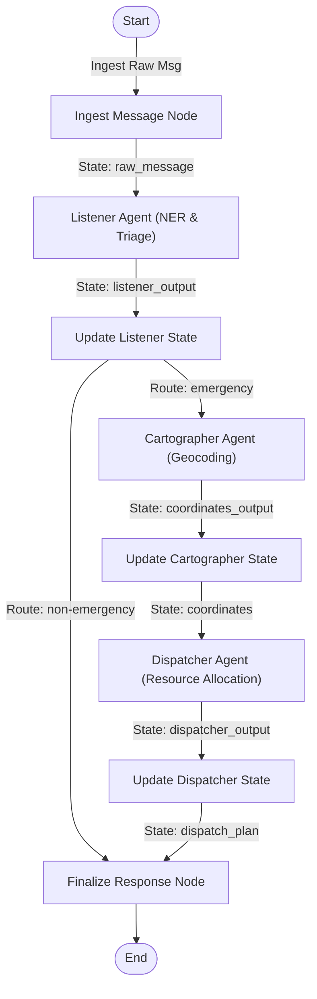

# Crisis-Router: Multi-Agent Emergency Dispatch & Triage System

**Kaggle AI Agents Intensive - Capstone Project**  
**Track:** Agents for Good

---

## 1. Project Overview

During natural disasters (e.g., severe flooding, hurricanes, fires), traditional emergency voice hotlines (like 911) face immediate bottlenecks due to volume overload and call queues. However, internet data packets (SMS, satellite text messages, social media posts, WhatsApp signals) can transmit even on degraded networks.

**Crisis-Router** is a multi-agent emergency response triage system built with the **Vertex AI Agent Development Kit (ADK)** and **FastAPI / Streamlit**. It automatically ingests unstructured distress signals, triages the urgency, extracts locations, geocodes them on an interactive operational map, and dynamically dispatches matching rescue resources from a tracked real-time registry.

---

## 2. System Architecture

The project employs a structured graph workflow composed of three specialized agents collaborating through a validated shared Pydantic state schema, using conditional routing to handle non-emergencies dynamically:



### The Three Agents:
1. **Listener Agent (Ingestion & Triage)**:
   - **Role**: Receives the raw message, performs Named Entity Recognition (NER), and classifies if the signal requires emergency first responder dispatch.
   - **Output**: Extracts `is_emergency` (bool), `urgency` (Critical, High, Moderate, Informational), `incident_type` (Fire, Flood, Medical, etc.), and `location_text`.
2. **Cartographer Agent (Geocoding)**:
   - **Role**: Geocodes the text location into exact `lat` and `lon` coordinates.
   - **Tool**: Bound to `geocode_location` which queries the live OpenStreetMap Nominatim web API with custom user-agent compliance and local fallback support.
3. **Dispatcher Agent (Resource Allocation)**:
   - **Role**: Assigns a simulated rescue unit based on the incident state.
   - **Tool**: Bound to `allocate_rescue_unit` which checks the real-time availability of rescue engines from a persistent database, registers the deployment, and returns the response.

---

## 3. Core Agentic Principles Demonstrated

*   **Separation of Concerns (Specialization)**: Instead of a monolithic prompt attempting multiple tasks, the workflow decomposes into specialized micro-agents with custom system instructions, schemas, and tools.
*   **Tool Use (Function Calling)**: Agents autonomously interact with outside services (OSM Geocoding API) and local systems (persistent JSON database registry) via function bindings.
*   **Structured Shared Memory (Blackboard Pattern)**: All nodes read and write to a central validated `CrisisState` Pydantic schema, ensuring type-safe coordination without context-drift.
*   **Stateful Resource Management**: The system tracks stateful rescue units (`Fire Engine 1`, `Rescue Boat 2`, `Ambulance 3`, etc.) across multiple incoming signals, shifting units to `Busy` when deployed and allowing responders to release them via a dashboard reset.
*   **Conditional Agentic Routing**: Implements dynamic branching edges in the graph workflow; if the triage classifier determines a signal is a non-emergency, it automatically bypasses downstream geocoding/dispatch agents and logs the inquiry informational status directly.

---

## 4. Operational Dashboards (Role-Separated)

The interface in [dashboard.py](file:///c:/Users/alexe/disaster-response-agent/disaster-response/app/dashboard.py) separates access based on the user's role:

1.  **Civilian Distress Console**:
    - Clean, reassuring reporting interface for victims.
    - Prompts for presets or custom text inputs.
    - If emergency is detected, outputs: *"Emergency Signal Ingested successfully. First responder dispatched: [Responder]. Please stay safe."*
    - If non-emergency is detected, outputs a warning banner: *"Signal Processed & Logged. No emergency rescue deployment required."*
2.  **Dispatcher Ops Center**:
    - **Live Operational Map**: A Folium map rendering coordinates, urgency ratings (color-coded red/orange markers), and dispatch plans for all logged incidents.
    - **Rescue Unit Status Registry**: Live status monitoring table showing unit allocations (Available vs Deployed).
    - **Incident Log**: Historical table log of parsed distress signals including their classification.

---

## 5. Offline Simulator Mode (No Rate Limits)

To enable 100% reliable, rate-limit-free visualizations and offline demonstration, the project features a **Local Simulator Mode** (toggleable in the Streamlit sidebar):
*   **Enabled**: Bypasses the Gemini LLM API entirely, running rule-based/regex mock processors that mimic the ADK multi-agent workflow in 0ms.
*   **Disabled**: Executes the full Vertex AI/Google AI Studio Gemini workflow (packaged with 3-second pacing sleeps and 6-attempt exponential backoffs to prevent free-tier API rate limits).

---

## 6. How to Run Locally

### 1. Configure the Environment
Copy the example environment file and insert your API key:
```bash
cp .env.example .env
```
Ensure `.env` contains:
```env
GEMINI_API_KEY=your-gemini-api-key
```

### 2. Start the Backend API Server
```bash
uv run python -m uvicorn app.fast_api_app:app --host 0.0.0.0 --port 8000
```

### 3. Start the Streamlit Dashboard
```bash
uv run streamlit run app/dashboard.py
```
